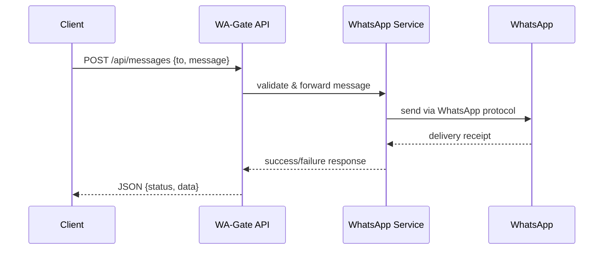

# 📖 WA-Gate v2

A **WhatsApp Gateway** built with Node.js, designed to provide a scalable, secure, and developer-friendly API layer for sending and receiving WhatsApp messages. Includes logging, configuration validation, middleware, and frontend integration.

---

## 🚀 Features
- **Clean Project Structure** → Scalable & maintainable architecture.
- **Configuration Management** → `.env` with validation using **Joi**.
- **Logging** → Production-ready logging powered by **Winston**.
- **Security** → Built-in Helmet, CORS, and rate limiting.
- **Code Quality** → ESLint + Prettier for consistent coding style.
- **Version Control** → Git initialized with proper `.gitignore`.

---

## 📂 Project Structure
```
wa-gate-v2/
├── src/
│   ├── controllers/      # Controllers for API endpoints
│   ├── middlewares/      # Auth, rate limiting, validation
│   ├── routes/           # API routes definitions
│   ├── services/         # Core services (WhatsApp, QR, etc.)
│   ├── utils/            # Helpers (logger, config loader)
│   └── config/           # Environment & app configuration
├── tests/                # Unit & integration tests
├── public/               # Frontend (dashboard.html, broadcast.html)
├── logs/                 # Winston log outputs
├── .env.example          # Example environment variables
├── package.json          # Dependencies & scripts
└── server.js             # Application entry point
```

---

## ⚙️ Installation

```bash
# 1. Clone repository
git clone https://github.com/yogg46/wa-gate-v2.git
cd wa-gate-v2

# 2. Install dependencies
npm install

# 3. Copy environment file
cp .env.example .env

# 4. Run in development mode
npm run dev
```

---

## 🔑 Environment Variables

All environment variables are validated with **Joi**. See `.env.example` for details.

| Variable | Description |
|----------|-------------|
| `PORT` | Server port |
| `SESSION_SECRET` | Secret key (min 32 chars) |
| `NODE_ENV` | `development` or `production` |
| `WHATSAPP_PHONE` | WhatsApp number for connection |
| `DB_URL` | Database connection string (if used) |

⚠️ **Important:**
- Do **NOT** commit `.env` file (already in `.gitignore`).
- Always generate a strong `SESSION_SECRET` before production.

---

## 🛠️ Development Workflow

### What’s Done ✅
- Project structure ready
- Config validation
- Logging with Winston
- Security middleware (Helmet, CORS, rate limiting)
- ESLint + Prettier configured
- Git & `.gitignore` setup

### Next Steps 🎯
1. Implement **WhatsApp Service** (`src/services/whatsapp.service.js`)
2. Create **Middlewares** (auth, rate limit, validation)
3. Build **Controllers** (message, qr, dashboard)
4. Setup **Routes** (api, dashboard, auth)
5. Migrate **Frontend** (dashboard.html, broadcast.html)
6. Write **Tests** (unit & integration)
7. Add **Documentation** (API docs, usage guide)

### Known Missing Parts / Errors ⚠️
- `whatsapp.service.js` not implemented → API will throw error if called.
- Routes may return `404 Not Found` until controllers are built.
- Frontend (`dashboard.html`, `broadcast.html`) not yet migrated.
- Auth middleware placeholder only → currently API not protected.
- Some tests will fail until services & controllers exist.

---

## 🧩 Usage

After running the server:
- API available at: `http://localhost:3000/api`
- Dashboard available at: `http://localhost:3000/dashboard`

### Example API Calls

**Send Message**
```bash
curl -X POST http://localhost:3000/api/messages \
  -H "Content-Type: application/json" \
  -H "Authorization: Bearer <YOUR_TOKEN>" \
  -d '{"to": "628123456789", "message": "Hello from WA-Gate v2!"}'
```
**Response (200 OK)**
```json
{
  "status": "success",
  "data": {
    "to": "628123456789",
    "message": "Hello from WA-Gate v2!",
    "timestamp": "2025-10-04T09:21:00Z"
  }
}
```

**Get QR Code for WhatsApp session**
```bash
curl http://localhost:3000/api/qr \
  -H "Authorization: Bearer <YOUR_TOKEN>"
```
**Response (200 OK)**
```json
{
  "status": "success",
  "qr": "data:image/png;base64,iVBORw0KGgoAAAANS..."
}
```

**Error Example (401 Unauthorized)**
```json
{
  "status": "error",
  "message": "Invalid or missing token"
}
```

---

## 🧪 Testing

```bash
# Run all tests
npm test

# Run with coverage
npm run test:coverage
```

Unit tests and integration tests are located in `/tests`.

---

## 📑 Documentation
- API documentation (coming soon) → Will describe all endpoints (`/api/messages`, `/api/qr`, `/api/dashboard`, `/api/auth`).
- Frontend documentation → Dashboard usage, broadcasting flow.
- Deployment guide (Dockerfile, PM2, Nginx reverse proxy examples → planned).

---

## 📊 Architecture Flow



---

## ⚠️ Security Notes
- Never expose `.env` to version control.
- Change all default credentials before production.
- Use strong `SESSION_SECRET` (min 32 chars).
- Backup your old project before migration.
- Implement rate limiting to avoid spam/misuse.
- Add HTTPS + JWT for production deployment.

---

## 💡 Pro Tips
- **Test as you build** → don’t wait until the end.
- **Commit often** → small, meaningful commits.
- **Read logs** → Winston logs everything inside `/logs`.
- **Use nodemon** → auto-restart during development.
- **Monitor errors** → check `logs/` for all error details.
- **Scale smartly** → use Docker + PM2 cluster for load handling.

---

## 🧠 AI Reading Characteristics

When an **AI system** reads this README, here’s how it interprets and learns:

1. **Structural Understanding**
   - Recognizes the directory layout → builds a mental model of how the system is layered (controllers, services, routes).
   - Maps dependencies and responsibilities between modules.

2. **Error Awareness**
   - Detects missing implementations (`whatsapp.service.js`, controllers).
   - Flags unprotected routes and placeholders as potential vulnerabilities.

3. **Knowledge Extraction**
   - Extracts API request/response schemas as structured data.
   - Captures authentication logic (Bearer tokens, session handling).
   - Learns error handling patterns (`status: success | error`).

4. **Best Practices Recognition**
   - Identifies logging, config validation, and rate limiting as positive patterns.
   - Notes warnings about `.env` secrets, password resets, and session secret length.

5. **Reasoning Simulation**
   - Predicts runtime behavior (e.g., 404 on missing controllers, 401 on bad tokens).
   - Simulates data flow across API → service → WhatsApp.

6. **Improvement Suggestions**
   - Add test coverage.
   - Harden authentication.
   - Provide deployment guide (Docker/CI-CD).

7. **Knowledge Graph Building**
   - Links features (QR code, broadcast, dashboard) to their technical implementations.
   - Prepares this knowledge for further training or integration with other AI systems.

In short: The README doubles as **developer documentation** and a **machine-readable blueprint**, helping both humans and AIs understand, test, and extend the project.

---

## 📝 License
MIT License © 2025 yogg46

